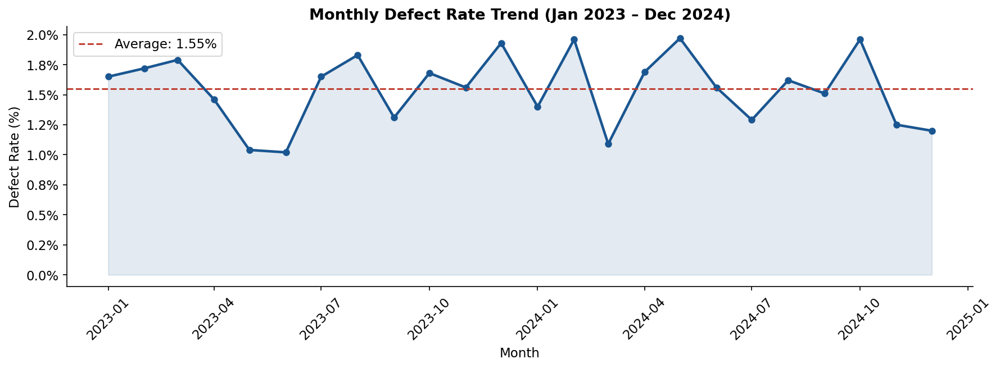
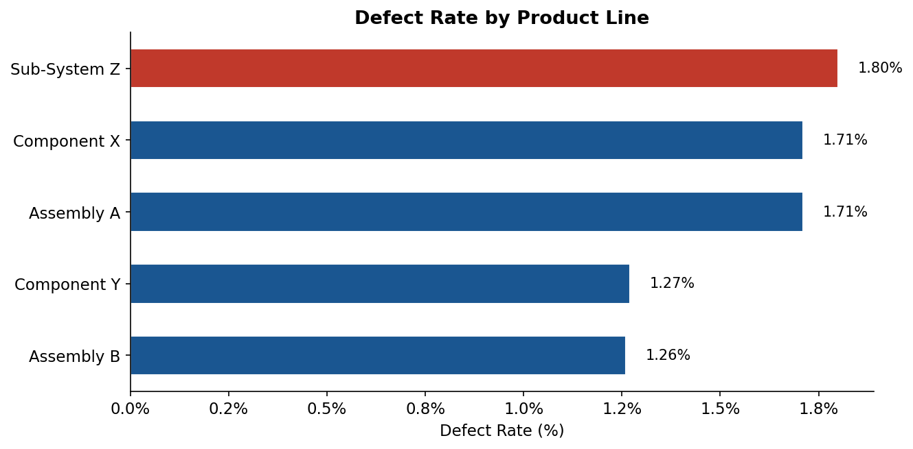
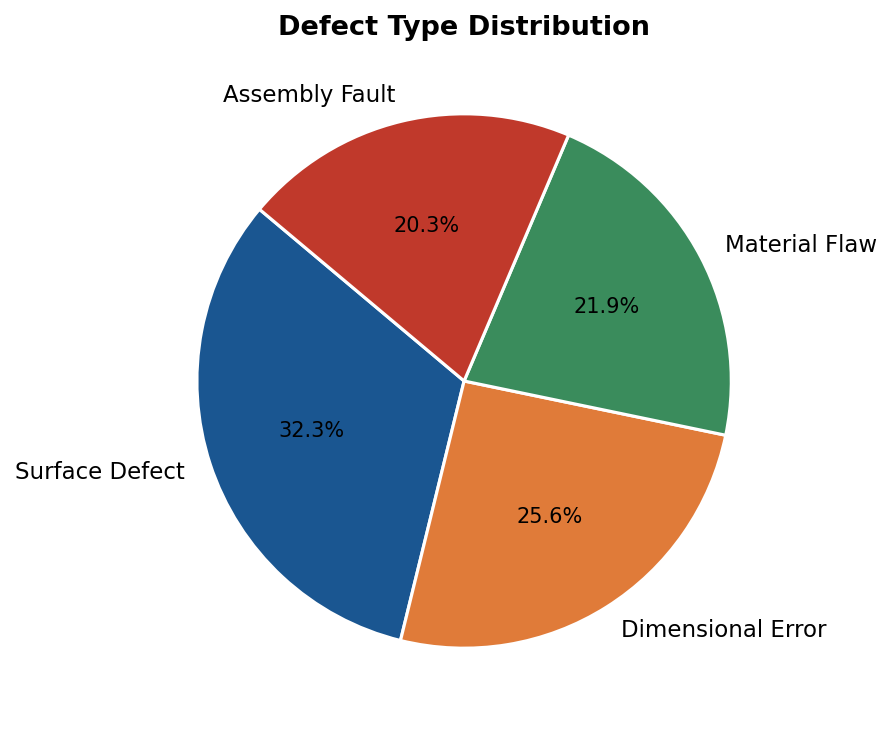
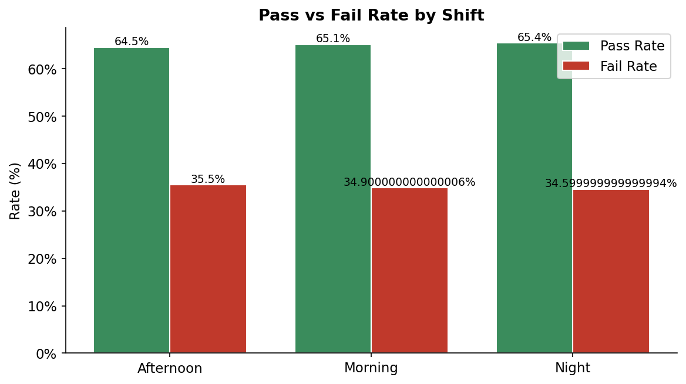
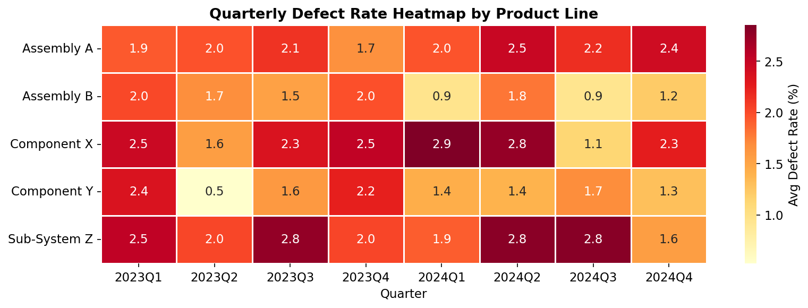
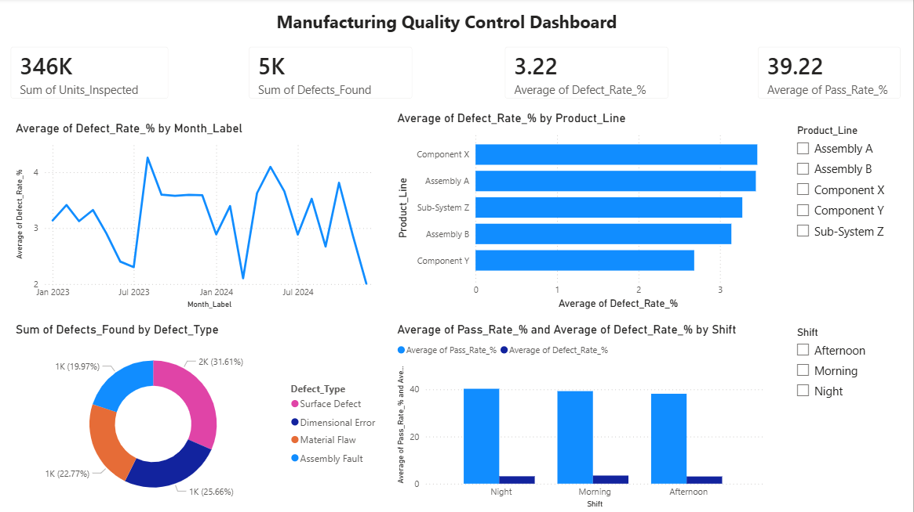

# Manufacturing Quality Control Analytics Dashboard

## Project Overview

This project simulates a real-world **digital quality management workflow** for a manufacturing environment. The goal was to analyze production inspection data, identify defect patterns and failure trends across product lines, and build a structured dataset ready for interactive Power BI reporting.

The project was built to demonstrate applied skills in data analysis, quality KPI tracking, and data visualization — directly relevant to digital quality assurance roles in industrial and aerospace environments.

---

## Business Problem

Quality teams in manufacturing environments often deal with large volumes of inspection records spread across shifts, product lines, and time periods. Without a centralized digital view, identifying recurring defect patterns or deteriorating quality trends requires significant manual effort.

This project addresses that by:
- Consolidating inspection records into a structured dataset
- Calculating key quality KPIs automatically
- Visualizing trends to enable faster, data-driven decisions
- Exporting a clean summary table ready for Power BI dashboards

---

## Dataset

- **Source:** Simulated manufacturing inspection dataset (2,000 records)
- **Period:** January 2023 – December 2024
- **Product Lines:** Assembly A, Assembly B, Component X, Component Y, Sub-System Z
- **Defect Types:** Surface Defect, Dimensional Error, Material Flaw, Assembly Fault
- **Fields:** Date, Product Line, Defect Type, Shift, Inspector, Units Inspected, Defects Found, Pass/Fail

---

## Tools & Technologies

| Tool | Purpose |
|------|---------|
| Python (Pandas) | Data cleaning, feature engineering, KPI calculation |
| Matplotlib & Seaborn | Static data visualizations |
| Power BI | Interactive dashboard (see screenshots below) |
| CSV Export | Structured summary table for Power BI ingestion |

---

## Key Quality KPIs

| KPI | Value |
|-----|-------|
| Total Units Inspected | 346,347 |
| Total Defects Found | 5,359 |
| Overall Defect Rate | 1.55% |
| Pass Rate | 65.0% |
| Most Common Defect | Surface Defect |
| Highest Defect Line | Sub-System Z |

---

## Analysis & Findings

### 1. Monthly Defect Rate Trend


Defect rates fluctuate month to month with a visible seasonal pattern. Several months exceed the average defect rate of ~1.55%, signaling periods where quality interventions would be warranted.

---

### 2. Defect Rate by Product Line


**Sub-System Z** consistently shows the highest defect rate across the analysis period, making it the primary target for quality improvement initiatives. **Assembly B** performs best with the lowest defect rate.

---

### 3. Defect Type Distribution


**Surface Defects** are the most frequently occurring defect type, accounting for the largest share of all recorded defects. This points to potential issues in the surface treatment or handling stage of the production process.

---

### 4. Pass vs Fail Rate by Shift


All three shifts show similar pass/fail ratios, suggesting that shift-related factors are not a primary driver of defect rates. Quality issues appear systemic rather than shift-specific.

---

### 5. Quarterly Defect Rate Heatmap


The heatmap provides a cross-sectional view of defect rates by product line and quarter. Sub-System Z shows elevated rates across multiple quarters while Component Y remains relatively stable, helping prioritize where resources should be focused.

---

## Power BI Dashboard

An interactive dashboard was built in Power BI using the exported summary data, featuring slicers for Product Line and Shift to enable dynamic filtering across all visuals.



**Dashboard includes:**
- KPI cards: Total Units Inspected, Total Defects Found, Avg Defect Rate, Avg Pass Rate
- Monthly defect rate trend line chart
- Defect rate by product line horizontal bar chart
- Defect type breakdown donut chart
- Pass vs Fail rate by shift column chart
---

## Project Structure

```
quality-control-analytics/
│
├── data/
│   └── manufacturing_quality_data.csv       # Raw inspection dataset
│
├── outputs/
│   ├── 01_monthly_defect_trend.png
│   ├── 02_defect_rate_by_product_line.png
│   ├── 03_defect_type_breakdown.png
│   ├── 04_pass_fail_by_shift.png
│   ├── 05_quarterly_heatmap.png
│   └── quality_summary_for_powerbi.csv      # Power BI ready export
│
├── generate_data.py                         # Dataset generation script
├── analysis.py                              # Main analysis & visualization script
└── README.md
```

---

## How to Run

```bash
# Clone the repository
git clone https://github.com/umarsidiqi/quality-control-analytics.git

# Navigate to the project folder
cd quality-control-analytics

# Install dependencies
pip install pandas numpy matplotlib seaborn

# Generate the dataset
python generate_data.py

# Run the full analysis
python analysis.py
```

---

## Author

**Muhammad Umar Siddiqui**
Master's student in International Information Systems — FAU Erlangen-Nürnberg
[LinkedIn](https://www.linkedin.com/in/umar-sidd/)
